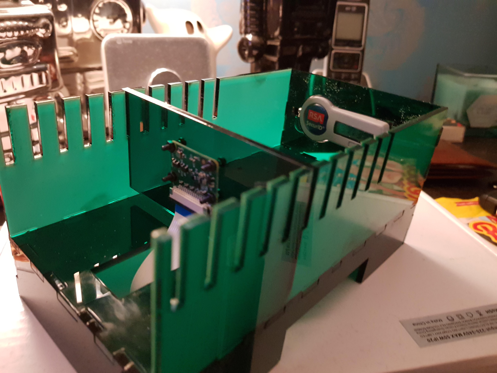
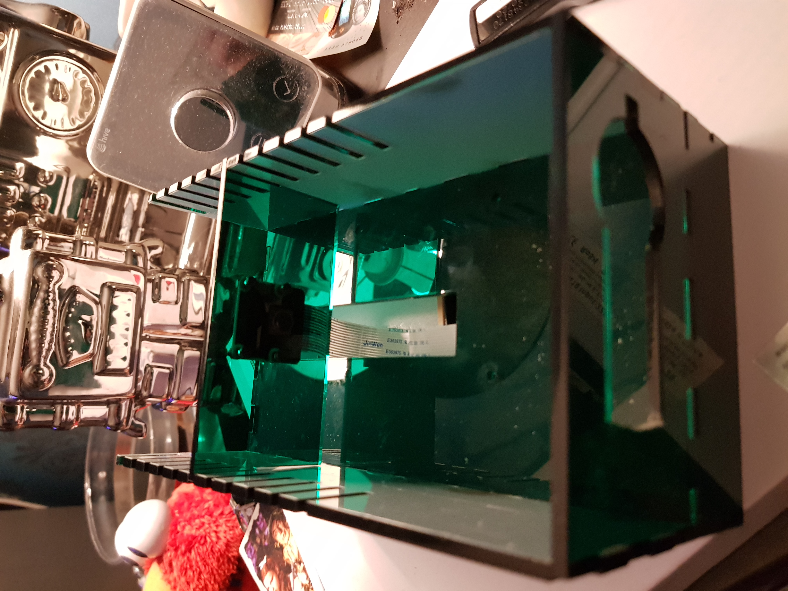

I recently became the owner of a tile tracker after a amazon sale and got hooked. I've since went and boought a Keysmart pro which was more disappointing but that's another story.

Being focused on keys and what I carry about I wanted to remove anything that could be seen as unnecessary. Enter my RSA keyfob that is used to identify me for work stuff.

The easy way would of been to ask for a software version that installs on my phone but this alternative seemed like a easier option.

I realised that I don't *really* need to carry the fob to access my work, I just need to know what the code is being displayed. So I have gone down the road of using a spare raspberry pi with a camera.

I understand that this could be considered reducing security so I have taken some steps to protect the server. I will be restricting the access to my lan computers only. I will also consider using a username and password to add an extra layer of security.

The CAD files that I have made and the configuration will be available on my github.

## Mock up
-----

I came up with some designs on paper and mocked some of them up with cardboard.

I abandoned the design of an angled holder as it didn't provide much space saving and also had the issue of not being very flexible.

The cardboard prototyping was very useful as I found out about the Raspberry Pi camera focus. The minimum distance from the camera to the RSA token was about 10cm.

## Fusion360
-----

Here is the real reason why this project was created. I wanted to learn more about fusion and this seemed to be a simple problem to solve.

Here are some screenshots of my model and then I've exported the file as a DXF.

## Laser cutting
-----

I went to the Sheffield Hackspace to use their laser cutter. Roughly £7 in materials and laser time I was given a load of acrylic parts to put together.

## Asembly
-----

Surprisingly all the parts fitted together really nicely, and here is a photo of it put together.

The only issue I had was the little wall at the back, it didn't seem to have enough friction to keep it in space as much. This can be easily fixed with some glue or solvent.

Unfortunately I didn't have any standoffs available so the Raspberry Pi is just sitting underneath for the time being.

## Software
-----

Currently it will just take a picture and publish it to the web.

This apache nginx is only allowed to talk to local computers.

## Up and running

Finally here is an image of my remote connection back to the pi collecting the image

## Improvements
-----

I found out about some interesting things from this project, I'm sure I will continue to revise it every now and again. Some of the things that stand out which would of made this project better. 

* Engrave distances on the slots on the top of the box. 

* more of a gap to allow the power cord to be included in the box.

* Any questions or errors that need fixing please email me.

* Smaller/more finger joints on faces that don't have much of an edge. 